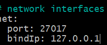
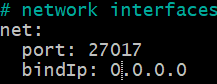
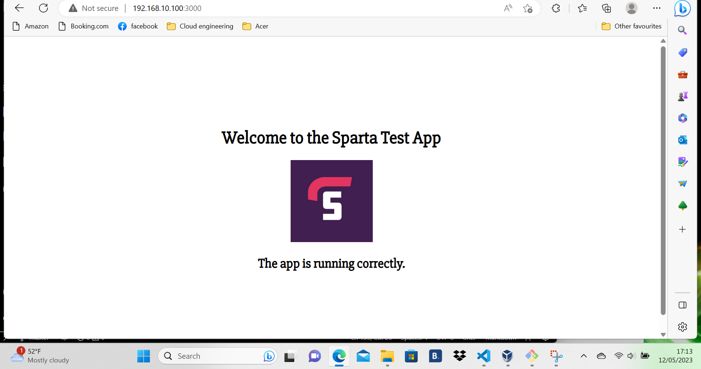

# Connecting the database and the app

## Database

### Carrying on from multi_machine_vm.md. 

The database has been launched and enabled but we need to change some congifurations. For the purpose of this test - we need to configure the port settings so it allows all IP addresses to access it. 

To access the configuration file, use:

```sudo nano /etc/mongod.conf```

The file should look like this:


Use the arrow keys to scroll down to the section called network interface and change the IP from this:



To:



Save and exit with:

```Ctrl + x```
```y```
```Enter```

Restart the database:

```sudo systemctl restart mongod```

Check the status:

```sudo systemctl status mongod```

If it is active, use : ```q``` to exit

And finally for our database section, enable it again:

```sudo systemctl enable mongod```

## App

So when we launched the Sparta app previously we accessed what was called a "static" webpage which means doesn't have any place holders for data to be called up or variables to store said data.

We want to add a "dynamic" page given to us by the Devs called "posts". This page will call on information from the database for the "posts" page and store information in a variable we are about to create.

There are a few steps to setting up a variable. Here is an example:

- You can set a variable like this : MY_VAR=hello
- To print the variable: $MY_VAR - return hello - The "$" calls the function
- To make a variable global use the export cmd : - export MY_VAR=hello 
- Global variables are deleted if you stop or close your vm
- To make global variables persist, we have to add it to our environment variables.

### Creating and updating environment variables

As stated in the previous section, we need to create a global variable and make it persistant by adding it to our environment variables.

Our variable was given to us by the Devs:

```DB_HOST=mongodb://192.168.10.150:27017/posts```

To add this to our environment variables, we have to open a hidden file called .bashrc:

```sudo nano .bashrc```

The file should look like to this:


Scroll all the way to the bottom and add our variable:

```DB_HOST=mongodb://192.168.10.150:27017/posts```


To save and exit:

```Ctrl + x```
```y```
```Enter```

To check the variable has been added to the environment variables use:

```printenv```

It should look like this:


### Install node packages and manager

We need to get the nodejs packages so we can run the app, to do this we need the package manager. 

First we need to change to our app directory : ```cd app```

Then we run:

```sudo apt install npm```

```npm install```

This will install the package manager and the packages and the file node seeds/seed.js

It should look like this:


Nex we want to run the code:

```node seeds/seed.js```

And we should get back that the database has been cleared and we can run it. Also that the database has been seeded, which means that the information stored in the database, can be accessed and shown on the "posts" page.


### Run the app and posts page

Lastly we run the code:

```npm start```

It should launch on port 3000


Finally check its running on:

http://192.168.10.100:3000

It should look like this:



Posts should look like:

.png)

Congratulations!