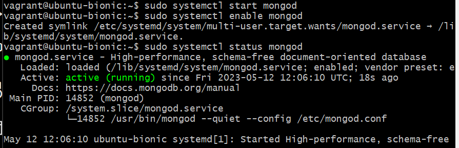
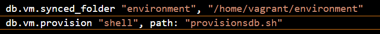

# Setting up multiple virtual machines on one device

First we want to set up our first VM "app". Make sure we are in the right directory, for me it is: 

```cd tech230_visualisation/tech230_multi_machine```

Then we copy and edit our vagrantfile and provisions file from our folder:

```tech230_visualisation/tech230_app_deployment```

To:

```tech230_visualisation/tech230_multi_machine```

Open the Vagrant file and make the following changes.
Underneath the following code:

```Vagrant.configure("2") do |config|```

Add:

```config.vm.define "app" do |app|``` but make sure this is indented

Then all the ```config.``` lines of code that fall under the scope of ```config.vm.define "app" do |app|``` -- Change ```config.``` to ```app.```

It should look like this:


After you connect your provision line of code: ```app.vm.provision "shell", path: "provisions.sh"```

Add:

```end``` underneath so that the app code block comes to an end:


Next we move onto our "db" code block:

You should do almost the same as what you did in the "app" code block and change all the ```config.``` lines of code to ```db.``` -- so it should look like this:


Make sure not to forget the ```end``` 

Take note, for the time being we have no ```app.vm.provision "shell", path: "provisions.sh"``` line.

### Update your provisions file

At this point we want to comment out a couple of commands:

```#cd tech230_app_deployment```
```#cd app```
```#sudo npm install pm2 -g```
```#npm start```

So it should look like this:


### Launch VMs, ssh and configue

So now you want to launch the VMs, use command: ```vagrant up``` inside your VS Code bas terminal.

Then you open TWO git bash terminals and use command: ```vagrant ssh database``` to access the database and ```vagrant ssh app``` to access the app.

Type command :```ls``` into both terminals the one that has the "environment" directory is the database and the one that says "app" is the app.

### Setting up the database

We want the git bash terminal that is the database.

Update and upgrade the system :```sudo apt-get update -y``` ```sudo apt-get upgrade -y```

Get a key to verify authenticity for MongoDB using:```sudo apt-key adv --keyserver hkp://keyserver.ubuntu.com:80 --recv D68FA50FEA312927``` 

Specify a package repository for MongoDB :```echo "deb https://repo.mongodb.org/apt/ubuntu xenial/mongodb-org/3.2 multiverse" | sudo tee /etc/apt/sources.list.d/mongodb-org-3.2.list``` 

Then update and upgrade again for the database with: ```sudo apt-get update -y" ```sudo apt-get upgrade -y```

Install all the new pacakges for MongoDB using : ```sudo apt-get install -y mongodb-org=3.2.20 mongodb-org-server=3.2.20 mongodb-org-shell=3.2.20 mongodb-org-mongos=3.2.20 mongodb-org-tools=3.2.20```

To start start the database ues : 

```sudo systemctl start mongod```

To enable the database so other users can access it use:

```sudo systemctl enable mongod```

To check the database is active use :

```sudo systemctl status mongod```

Press : ```q``` to exit

Please note that the command is "mongod" not "mongodb"

It should look like:



### Automate db setup

First create a new provision file, mine is called provisionsdb.sh.

Add the following code to the file:

#!/bin/bash

```sudo apt-get update -y```
```sudo apt-get upgrade -y```
```sudo apt-key adv --keyserver hkp://keyserver.ubuntu.com:80 --recv D68FA50FEA312927```
```echo "deb https://repo.mongodb.org/apt/ubuntu xenial/mongodb-org/3.2 multiverse" | sudo tee /etc/apt/sources.list.d/mongodb-org-3.2.list```
```sudo apt-get update -y```
```sudo apt-get upgrade -y```
```sudo apt-get install -y mongodb-org=3.2.20 mongodb-org-server=3.2.20 mongodb-org-shell=3.2.20 mongodb-org-mongos=3.2.20 mongodb-org-tools=3.2.20```
```sudo systemctl start mongod```
```sudo systemctl enable mongod```

Then in your vagrant file add:

```db.vm.provision "shell", path: "provisionsdb.sh"```

Here:



Now it should all be automated.


The previous code was throwin back errors, so I changed the code and it now works, here is the changed code:

```sudo apt-get update -y```
```sudo apt-get upgrade -y```
```sudo apt-get install nginx -y```
```sudo systemctl start nginx```
```sudo systemctl status nginx```
```sudo apt-get install python-software-properties```
```curl -sL https://deb.nodesource.com/setup_12.x | sudo -E bash -```
```sudo apt-get install nodejs -y```
```sudo npm install pm2 -g```


# Go to connecting_env_and_app.md

