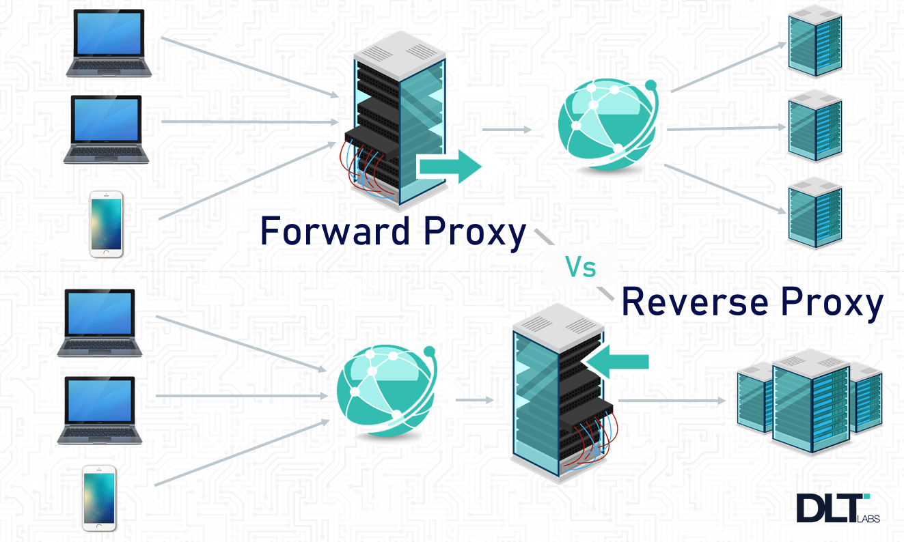
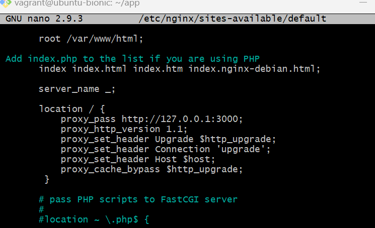
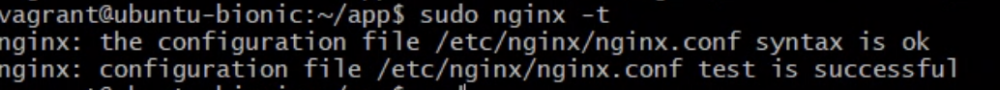

# Reverse proxy neginx

### What is a port?

A port is a software construct that allows communication between processes or applications over a network and is identified by a numerical value called a port number.

Ports are identified by a numerical value called a port number, which is assigned to a specific protocol or service. For example, port 80 is commonly used for HTTP web traffic, while port 443 is used for secure HTTPS web traffic. Ports can also be used to differentiate between multiple processes or applications running on the same system.

### Reverse proxy and proxy


Reverse Proxy:

A reverse proxy server acts as an intermediary between clients and servers. When a client sends a request to access a resource, the request is first received by the reverse proxy server, which then forwards the request to the appropriate server. The response from the server is sent back to the reverse proxy server, which then sends it back to the client.

Here are some of the main benefits of using a reverse proxy:

- Load balancing: The reverse proxy can distribute incoming traffic across multiple servers to improve performance and availability.

- SSL/TLS offloading: The reverse proxy can handle SSL/TLS encryption and decryption, offloading this resource-intensive task from the servers.

- Caching: The reverse proxy can cache frequently accessed content, reducing the load on servers and improving response times for clients.

- Filtering: The reverse proxy can filter incoming traffic, blocking or redirecting requests based on criteria such as IP address, user agent, or content type.

- Security: The reverse proxy can provide an additional layer of protection against common security threats such as distributed denial of service (DDoS) attacks.

Forward Proxy:

A forward proxy server also acts as an intermediary between clients and servers. However, instead of forwarding requests to servers, the forward proxy forwards requests from clients to the internet. When a client sends a request to access a resource on the internet, the request is first received by the forward proxy server, which then forwards the request to the appropriate destination server on the internet. The response from the destination server is sent back to the forward proxy server, which then sends it back to the client.

Here are some of the main benefits of using a forward proxy:

- Anonymity: The forward proxy can mask the identity of the client device by presenting its own IP address to the destination server, providing anonymity and privacy.

- Filtering: The forward proxy can filter outgoing traffic, blocking or redirecting requests based on criteria such as content type or destination.

- Access control: The forward proxy can restrict access to certain websites or resources, providing control over internet usage within an organization.

- Caching: The forward proxy can cache frequently accessed content, reducing the amount of data that needs to be transmitted over the internet and improving response times for clients.

- Security: The forward proxy can provide an additional layer of protection against common security threats such as malware or phishing attacks.

In summary, both reverse proxies and forward proxies act as intermediaries between clients and servers, but they operate in different ways and have different benefits. Reverse proxies are used to improve performance, security, and control over incoming traffic to servers, while forward proxies are used to provide anonymity, filtering, access control, and caching for outgoing traffic from clients to the internet.



### What is nginx default

The default configuration file for Nginx in the /etc/nginx/sites-available/ directory on most Linux distributions is named default. This file is used as the default server configuration file by Nginx when no other server configuration files are specified.

The default configuration file typically includes the following elements:

server block: This block defines the configuration for the default server. The configuration includes the server name, the server listening port, the document root directory, and any other directives specific to the default server.

location block: This block defines the configuration for the location of the default server. The configuration includes the location name, the root directory, any access control directives, and any other directives specific to the location.

index directive: This directive specifies the file that should be served as the default index file for the server. By default, this is typically set to index.html.

error_page directive: This directive specifies the page that should be served in case of an error. By default, this is typically set to 404.html.

listen directive: This directive specifies the port number that the server should listen on. By default, this is typically set to port 80.

root directive: This directive specifies the root directory for the server. By default, this is typically set to /var/www/html.

access_log directive: This directive specifies the location of the access log file for the server.

error_log directive: This directive specifies the location of the error log file for the server.

### How to set up the reverse nginx proxy

You'll need to configure Nginx to act as a reverse proxy. Start by editing the default server block configuration file located in 

```/etc/nginx/sites-available/default```

it should look like


Scroll down until you get to the section that is not commented called "location" and edit it with the following:

```
location / {
            proxy_pass http://127.0.0.1:3000;
            proxy_http_version 1.1;
            proxy_set_header Upgrade $http_upgrade;
            proxy_set_header Connection 'upgrade';
            proxy_set_header Host $host;
            proxy_cache_bypass $http_upgrade;
         }
```    
    location /posts {
            proxy_pass http://localhost:3000/posts;
            proxy_http_version 1.1;
            proxy_set_header Upgrade $http_upgrade;
            proxy_set_header Connection 'upgrade';
            proxy_set_header Host $host;
            proxy_cache_bypass $http_upgrade;
    }
    

It should look like this:



Then save and exit:

```Ctrl + x```
```y```
```Enter```

Use command : ```sudo nginx -t``` to check for any syntax errors, it should look like :



Restart nginx:

```sudo systemctl restart nginx```

Then use:

```npm start``` (Ctrl +z and then bg, to make it run in the background)

And go back to check your page, if the url looks like this:


And not this:


And you still can see your posts page:


Then congratulations!
